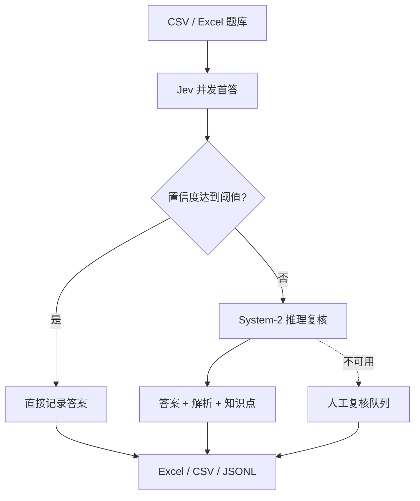

# Jev Quiz Router

一个面向选择题题库的自动化答题系统：用 **Jev / System One** 快速完成首答，把低置信度题自动升级给 **System-2 推理模型**，最后导出答案、解析、知识点与待复核清单。

> 项目定位是学习、题库整理和模型评测工具。请遵守考试纪律、题库版权和各 API 服务条款。

## 核心流程



## 已实现

- CSV、XLSX、XLSM 题库导入；自动识别常用中英文列名
- Jev 官方 HTTP API（`POST /v1/systemone`）
- 低置信度自动转发到任意 OpenAI-compatible Chat Completions API
- 并发、重试、逐题错误隔离
- SQLite 断点缓存，重复运行不重复请求已完成题目
- Excel 三张表导出：答题结果、运行摘要、待复核
- 已知标准答案时自动计算准确率
- Streamlit 网页界面 + CLI
- 演示模式与单元测试，无 API 密钥也能验证完整流程

## 重要说明：confidence 不是“答对概率”

Jev 的 `confidence` 由选项概率分布的形状计算，适合做分流信号，但不能未经验证就解释为真实准确率。建议先拿一批有标准答案的同类题运行，按科目统计不同阈值下的正确率，再选择生产阈值。

## 快速开始

要求 Python 3.10+。

```bash
git clone https://github.com/YOUR_NAME/jev-quiz-router.git
cd jev-quiz-router
python -m venv .venv
source .venv/bin/activate  # Windows: .venv\Scripts\activate
pip install -e .
cp .env.example .env
```

在 `.env` 中至少填写：

```dotenv
TYPESAFE_API_KEY=your_key
```

如果要启用低置信度推理复核，再填写：

```dotenv
REASONING_API_KEY=your_key
REASONING_MODEL=gpt-5.6
REASONING_BASE_URL=https://api.openai.com/v1
```

启动网页：

```bash
streamlit run app.py
```

命令行运行：

```bash
jev-quiz run examples/sample_questions.csv -o results/answers.xlsx
```

无密钥演示：

```bash
jev-quiz run examples/sample_questions.csv -o results/demo.xlsx --demo
```

演示模式的答案只是确定性占位值，仅用于检查导入、分流和导出流程。

## 题库格式

| 题号 | 科目 | 题干 | A | B | C | D | 标准答案 |
|---|---|---|---|---|---|---|---|
| 1 | 网络工程师 | TCP 位于哪一层？ | 物理层 | 数据链路层 | 传输层 | 应用层 | C |

必需列：题干（或 `question`）及至少两个选项列。选项支持 A～H。题号、科目和标准答案为可选列。

## 配置

| 环境变量 | 默认值 | 用途 |
|---|---|---|
| `TYPESAFE_API_KEY` | 无 | TypeSafe API 密钥 |
| `TYPESAFE_MODEL` | `jev-latest` | Jev 模型别名 |
| `TYPESAFE_BASE_URL` | `https://api.typesafe.ai/v1` | TypeSafe API 地址 |
| `REASONING_API_KEY` | 无 | 推理模型 API 密钥 |
| `REASONING_MODEL` | `gpt-5.6` | 推理模型名 |
| `REASONING_BASE_URL` | `https://api.openai.com/v1` | OpenAI-compatible API 地址 |

CLI 中可用 `--threshold`、`--concurrency`、`--no-reasoner` 调整分流和速度。

## 开发

```bash
pip install -e '.[dev]'
pytest
ruff check .
```

## Roadmap

- PDF / Word OCR 与题目切分
- 单选、多选、判断题统一 schema
- 按科目自动校准阈值与可靠性图
- Jev 与不同推理模型的成本、时延、准确率基准测试
- 错题本、间隔重复和知识点学习模式
- Docker 与云端部署模板

## License

[MIT](LICENSE)

